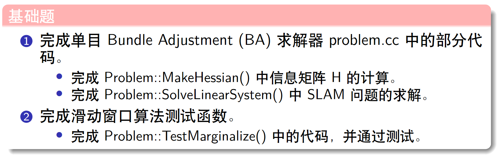

# AS5



## 一. 完成求解器problem.cc中的部分代码

void Problem::MakeHessian() :

```cpp
for (size_t j = i; j < verticies.size(); ++j) {
                auto v_j = verticies[j];

                if (v_j->IsFixed()) continue;

                auto jacobian_j = jacobians[j];
                ulong index_j = v_j->OrderingId();
                ulong dim_j = v_j->LocalDimension();

                assert(v_j->OrderingId() != -1);
                MatXX hessian = JtW * jacobian_j;
                // 所有的信息矩阵叠加起来
                // TODO:: home work. 完成 H index 的填写.
                // ow:H的横竖方向每一个节点都对应一个矩阵
                //noalias表示这里没有混淆, 结果可以直接复制给H,不需要产生中间变量
                H.block(index_i, index_j, dim_i, dim_j).noalias() += hessian;
                if (j != i) {
                    // H是一个轴对称的矩阵,同时给i,j对应的上下三角赋值
                    // TODO:: home work. 完成 H index 的填写.
                    H.block(index_j, index_i, dim_j, dim_i).noalias() += hessian.transpose();  //下三角
                }
            }
```

void Problem::SolveLinearSystem() :

```cpp
if(){...}
else {

        // SLAM 问题采用舒尔补的计算方式
        // step1: schur marginalization --> Hpp, bpp
        int reserve_size = ordering_poses_;
        int marg_size = ordering_landmarks_;

        // TODO:: home work. 完成矩阵块取值，Hmm，Hpm，Hmp，bpp，bmm
        //从下面可知,Hmm是对角线阵->Hmm对应Landmark
        MatXX Hmm = Hessian_.block(reserve_size,reserve_size, marg_size, marg_size);
        MatXX Hpm = Hessian_.block(0, reserve_size, reserve_size , marg_size);
        MatXX Hmp = Hessian_.block(reserve_size, 0, marg_size, reserve_size);
        // [ bpp, bmm ].T
        // segment(i, n)  index  n-elements
        VecX bpp = b_.segment( 0 , reserve_size);
        VecX bmm = b_.segment( reserve_size , reserve_size+marg_size);

        // Hmm 是对角线矩阵，它的求逆可以直接为对角线块分别求逆，如果是逆深度，对角线块为1维的，则直接为对角线的倒数，这里可以加速
        MatXX Hmm_inv(MatXX::Zero(marg_size, marg_size));
        for (auto landmarkVertex : idx_landmark_vertices_) {
            int idx = landmarkVertex.second->OrderingId() - reserve_size;
            int size = landmarkVertex.second->LocalDimension();
            Hmm_inv.block(idx, idx, size, size) = Hmm.block(idx, idx, size, size).inverse();
        }

        // TODO:: home work. 完成舒尔补 Hpp, bpp 代码
        MatXX tempH = Hpm * Hmm_inv;
        H_pp_schur_ = Hessian_.block(0,0, reserve_size, reserve_size) - tempH * Hmp;
        b_pp_schur_ = bpp - tempH * bmm;

        // step2: solve Hpp * delta_x = bpp
        VecX delta_x_pp(VecX::Zero(reserve_size));
        // PCG Solver
        for (ulong i = 0; i < ordering_poses_; ++i) {
            H_pp_schur_(i, i) += currentLambda_;
        }

        int n = H_pp_schur_.rows() * 2;                       // 迭代次数
        delta_x_pp = PCGSolver(H_pp_schur_, b_pp_schur_, n);  // 哈哈，小规模问题，搞 pcg 花里胡哨
        delta_x_.head(reserve_size) = delta_x_pp;
        //        std::cout << delta_x_pp.transpose() << std::endl;

        // TODO:: home work. step3: solve landmark
        // 原形式的求解公式,通过舒尔补变为: (ppt Ch5 S14) 公式中的bp不带符号,代码中的包含了负号
        // (Hpp - Hpm * Hmm.inverse * Hpm.T) * delta_xp = -bp + Hpm * Hmm.inverse * bm;
        // 得到delta_xp* 后, 在计算 delta_xm*
        // Hmm * delta_xm* = -bm - Hpm.T * delta_xp*
        VecX delta_x_ll(marg_size);
        delta_x_ll = Hmm_inv * (bmm - Hpm.transpose() * delta_x_pp);
        delta_x_.tail(marg_size) = delta_x_ll;
    }
```


如果直接编译运行补充后的程序,可以得到结果如左上图, 优化完成后，第一帧相机的 pose 平移（x,y,z）不再是原点 0,0,0. 说明向零空间发生了漂移。如果把TestMonoBA.cpp下面两行代码取消注释, 即采用fixation的方法,可以得到结果如右上图. 两种方式最大的区别就在第一次translation after opt, fix后, 第一次的trranslation就不会再被优化了, 就是 0,0,0


## 二.完成滑动窗口算法测试函数

```cpp
// TODO:: home work. 将变量移动到右下角
    /// 准备工作： move the marg pose to the Hmm bottown right
    // 将 row i 移动矩阵最下面
    Eigen::MatrixXd temp_rows = H_marg.block(idx, 0, dim, reserve_size);
    Eigen::MatrixXd temp_botRows = H_marg.block(idx + dim, 0, reserve_size - idx - dim, reserve_size);
    H_marg.block(idx,0, reserve_size - idx - dim, reserve_size) = temp_botRows;
    H_marg.block(reserve_size - dim,0, dim, reserve_size) = temp_rows;

...

// TODO:: home work. 完成舒尔补操作
    // |Arr  Arm  |
    // |Amr  Amm  |  
    //此处是把H_prior(Amm)放在了右下角, 计算边际概率的公式不变, 只是对应的矩阵块位置改变了
    Eigen::MatrixXd Arm = H_marg.block(0, n2, n2, m2);
    Eigen::MatrixXd Amr = H_marg.block(n2,0, m2, n2 );
    Eigen::MatrixXd Arr = H_marg.block(0,0,n2,n2);   //剩余变量

    // H_prior = Arr - Arm * Amm_inv * Amr
    Eigen::MatrixXd tempB = Arm * Amm_inv;
    Eigen::MatrixXd H_prior = Arr - tempB * Amr;
```


结果就验证了上课的说法: 一开始1和3关于2条件独立,及对应的H(0,2),H(2,0)=0; 而将2边缘化后,1和3产生关联,即marg了2后,将她的信息作为先验传给了1和3


## 总结论文《On the comparison of gauge freedom handlingin optimization-based visual-inertial state estimation》

优化过程中处理H自由度的不同操作方式。内容包括：具体处理方式，实验效果，结论

待最小化的目标函数为：


## 添加Prior约束

在TestMonoBA.cpp中

```cpp
#include "backend/edge_prior.h"

for (size_t i = 0; i < points.size(); ++i) {
        //假设所有特征点的起始帧为第0帧， 逆深度容易得到
        Eigen::Vector3d Pw = points[i];
        Eigen::Vector3d Pc = cameras[0].Rwc.transpose() * (Pw - cameras[0].twc);
        noise = noise_pdf(generator);
        double inverse_depth = 1. / (Pc.z() + noise);  //特征点在相机归一化平面的逆深度
//        double inverse_depth = 1. / Pc.z();
        noise_invd.push_back(inverse_depth);

        // 初始化特征 vertex
        shared_ptr<VertexInverseDepth> verterxPoint(new VertexInverseDepth());
        VecX inv_d(1);
        inv_d << inverse_depth;
        verterxPoint->SetParameters(inv_d);
        problem.AddVertex(verterxPoint);   //添加特征点节点
        allPoints.push_back(verterxPoint);

        // 每个特征对应的投影误差, 第 0 帧为起始帧
        for (size_t j = 1; j < cameras.size(); ++j) {
            Eigen::Vector3d pt_i = cameras[0].featurePerId.find(i)->second;
            Eigen::Vector3d pt_j = cameras[j].featurePerId.find(i)->second;
            //建立重投影误差,即对于两个相机pose时,得到的特征点在图像系坐标值的差值 TODO???
            shared_ptr<EdgeReprojection> edge(new EdgeReprojection(pt_i, pt_j));
            edge->SetTranslationImuFromCamera(qic, tic);

            std::vector<std::shared_ptr<Vertex> > edge_vertex;
            edge_vertex.push_back(verterxPoint);
            edge_vertex.push_back(vertexCams_vec[0]);  //给边添加其对应的两个相机pose节点
            edge_vertex.push_back(vertexCams_vec[j]);
            edge->SetVertex(edge_vertex);

            problem.AddEdge(edge);

            double weight = 0;
            for(size_t k=0; k<2; ++k){
                ///仿照上面的代码, 添加prior约束即添加新的测量(边)
                shared_ptr<EdgeSE3Prior> edgePrior(new EdgeSE3Prior(cameras[k].twc, cameras[k].qwc));

                ///
                std::vector<std::shared_ptr<Vertex> > edge_prior_vertex;
                edge_prior_vertex.push_back(vertexCams_vec[k]);     //多加上一个第一帧和第二帧的测量
                edgePrior->SetVertex(edge_prior_vertex);
                edgePrior->SetInformation(edgePrior->Information() * weight);
                problem.AddEdge(edgePrior);
            }
        }
    }
```

- 如果将weight设置为0, 符合第二题表格所示, 相当与是free gauge的情况, 可以看到下图和之前gauge fixation的结果类似. 运行时间每一次都会有些不同, 平均看都差不多. 注意这里要把之前fixation的两行代码注释掉


- 如果将weight改成一个很大的数字, 如10e9, 可以看到此时结果和fixation情况差不多.个人理解是: 给这个penalty项的权重非常大,想当于完全相信这个测量值
