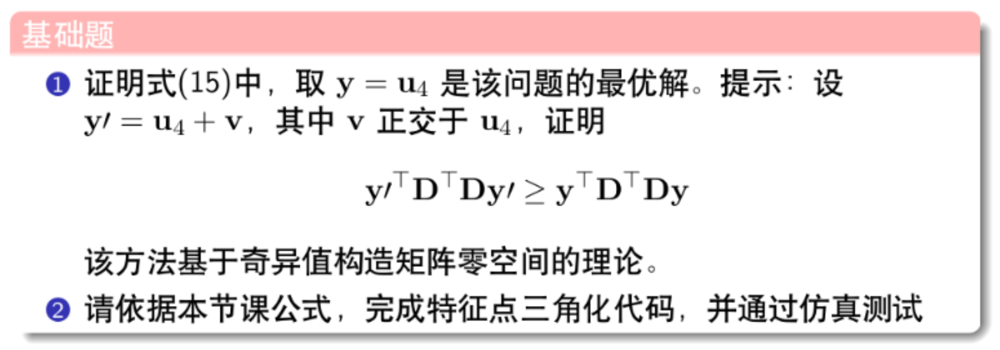
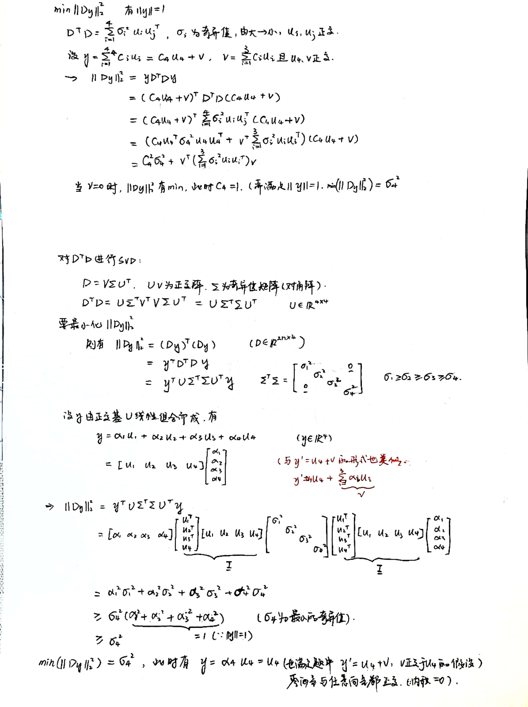

# AS6



## 一. 证明公式

对应课件：




## 二.特征点三角化代码

```cpp
/// TODO::homework; 请完成三角化估计深度的代码
    // 遍历所有的观测数据，并三角化
    //由于fx, fy =1.0，内参矩阵为I
    //相当于现在的相机归一化坐标就是图像坐标系下的观测值

    int size = end_frame_id - start_frame_id; //每一次观测对应2行
    Eigen::MatrixXd D(size * 2, 4);

    for (int j = start_frame_id; j < end_frame_id; j++) {
        //世界到相机坐标系的t,得到每一个观测的投影矩阵P
        Eigen::Matrix3d r_cw = camera_pose[j].Rwc.transpose();
        Eigen::Vector3d t_cw = -camera_pose[j].Rwc.transpose() * camera_pose[j].twc;
        Eigen::MatrixXd P(3, 4);
        P.block<3, 3>(0, 0) = r_cw;
        P.block<3, 1>(0, 3) = t_cw;
        double u = camera_pose[j].uv[0];
        double v = camera_pose[j].uv[1];
        D.block<1, 4>(2 * (j - start_frame_id), 0) = u * P.block<1, 4>(2, 0) - P.block<1, 4>(0, 0);
        D.block<1, 4>(2 * (j - start_frame_id) + 1, 0) = v * P.block<1, 4>(2, 0) - P.block<1, 4>(1,0);
    }
    // 遍历所有的观测数据，并三角化
    Eigen::Vector3d P_est;           // 结果保存到这个变量
    P_est.setZero();
    /* your code begin */
    Eigen::JacobiSVD<Eigen::MatrixXd> svd(D.transpose() * D, Eigen::ComputeFullU | Eigen::ComputeFullV);
    Eigen::Matrix4d V = svd.matrixV();
    P_est = V.block<3,1>(0,3) / V(3,3);

    //最小奇异值和第二小奇异值比值
    std::cout << "minimal singular value is " << svd.singularValues()[3] <<std::endl;
    std::cout << "second smallest singular value is " << svd.singularValues()[2] << std::endl;
    double proportion = svd.singularValues()[3] / svd.singularValues()[2];
    std::cout << "Proportion:  smallest / second smallest = " << proportion <<std::endl;
```

运行后得到的结果为：


可以看到最小奇异值远远小于倒数第二小的，满足ppt中的条件。此时没有给观测加噪声，所以得到的结果和真值相同


## 提升1：

对测量值加上噪声，即对观测到的像素坐标加噪声。比较好的噪声范围可以参考第五章作业中的代码TestMonoBA.cpp


直接写了一个大循环，一次就可以输出10种noise的结果

修改多次可以得到结果如下：

[测量噪声与奇异值比值的关系](https://www.notion.so/a451c98cbaf445f1af639c3ed79b1109)

```python
import matplotlib.pyplot as plt
import numpy as np
from matplotlib.pyplot import MultipleLocator

x = np.arange(0.2/1000, 2.2/1000, 0.2/1000)
y = [2.05238e-07,1.22578e-06, 3.018e-06, 6.04425e-06, 1.50953e-05, 3.19277e-05,
    2.34857e-05, 1.51098e-05, 4.14479e-05, 7.14013e-05]
plt.plot(x,y)
plt.plot(x,y,'o')
plt.xlabel('noise covariance',fontsize=14)
plt.ylabel('σ4/ σ3',fontsize=14)

x_major_locator=MultipleLocator(0.2/1000)
ax=plt.gca()
ax.xaxis.set_major_locator(x_major_locator)
plt.xlim(0.2/1000, 2.0/1000)

plt.show()
```


可以从图看到，随着方差增大，比值呈上升趋势

## 提升2：

一共10帧，index从0到9，将start_frame_id设置为[0,7], 也就对应于观测图像从10帧到3帧; 噪声方差固定为0.2/1000


结果如下：


随着观测帧数的增加，可以看出比值有下降的趋势，也就是说奇异值sigma4相对越来越小，更加准确（随着观测量的增加，三角化的结果也越准确）